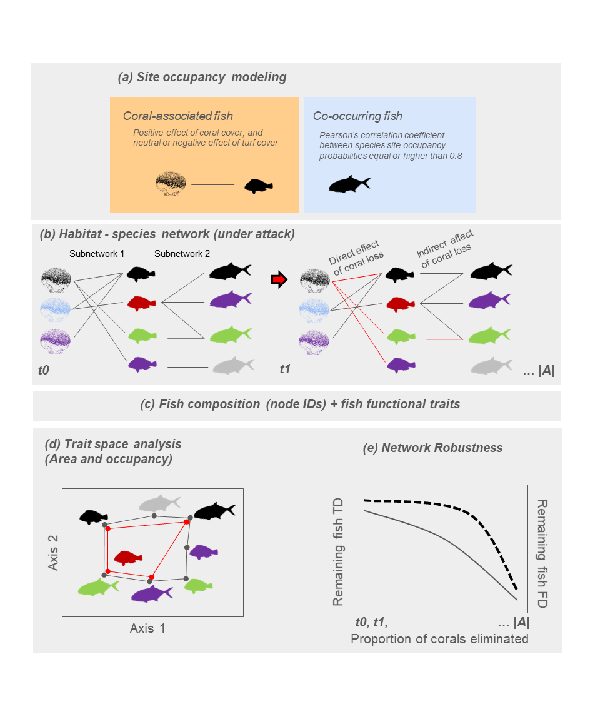
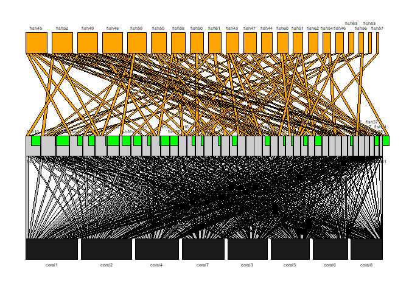
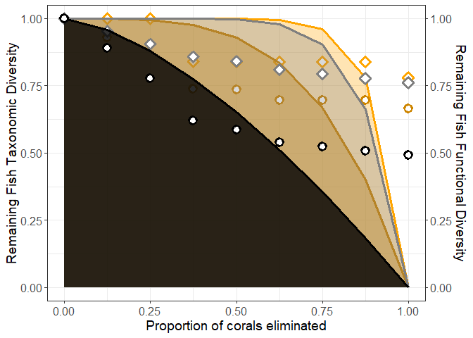

Coping with Collapse: Functional Robustness of Coral-Reef Fish Network
to Simulated Cascade Extinction
================

<!-- README.md is generated from README.Rmd. Please edit that file -->
<!-- badges: start -->
<!-- badges: end -->

This is a working example to run the framework developed to assess
network functional robustness in the context of cascading extinctions.
The example is just illustrative, and did not intend to produce the same
results reported in the manuscript.

The illustrated framework is depicted below. In step (1), we modeled the
occupancy probability of fish as a function of coral and turf algae
cover using site occupancy modeling. Based on the model output, we
classified species as either coral-associated or co-occurring fish. In
step (2), coral and fish species were connected based on the predicted
site occupancy probability of each coral-associated fish (fish with
different colors in the center of the network) relative to the cover of
each coral species (corals with different colors, in the left). Then,
coral-associated and co-occurring fish in subnetwork 2 were connected
based on Pearson’s correlation values between fish site occupancy
probability. With the networks established, we applied a removal
algorithm that eliminated corals and subsequently calculated the direct
and indirect effects of coral species removal on network robustness at
each elimination step (t0, t1, to \|A\|). Lost links are shown in red.
In step (3), we related fish species composition and species traits at
each elimination step. In step (4), we computed the loss in trait space
area following corals and fish removal. The area delimited by the black
polygon depicts the trait space area at t0, and the area delimited by
the red polygon depicts the trait space area at t1. Finally, in step
(5), we applied a hyperbolic function (non-linear model) to the
robustness data, analyzing both the remaining taxonomic diversity (TD,
represented on the first y-axis with a solid curve) and functional
diversity (FD, represented on the second y-axis with a dashed curve)
along the gradient of coral elimination (x-axis).


Study framework. Source of pictures to draw the silhouettes: coral:
picture by Vinicius J Giglio. Fish: FishBase.

<br> <br>

To illustrate the approach, we will simulate some data. Consider a set
of 8 species in the Partite A, 42 species in the Partite B, and 21
species in the Partite C (as our empirical data). The subnetwork 1 will
be composed by the Partites A and B, and the subnetwork 2 will be
composed by the Partities B and C. We will gather values resembling fish
occupancy probability/co-occurrence from a $Beta$ distribution with
shape parameters $a=0.5$ and $b=1$. This will produce a distribution
constrained between $[0,1]$, with most species showing low occupancy
probabilities relative to the species in partite A. We used the same
parameters to simulate data in partite C (resembling Pearson’s
correlations, $\rho$).

``` r
set.seed(2456)

nspA <-8 # sp in Partite A
nspB<-42 # sp in Partite B
nspC<-21 # sp in Partite C
nspp <- nspB+nspC # all species

# create subnetwork 1
subnetwork1 <- matrix(rbeta(nspA*nspB, shape1=.5, shape2 = 1),byrow=F,
                      nrow=nspA,
                      ncol=nspB)
subnetwork1 [subnetwork1>1]<-1 # set to 1 values larger than 1

# create subnetwork 2
subnetwork2 <- matrix(rbeta(nspB*nspC,shape1=.5, shape2 = 1),byrow=F,
                      nrow=nspB,
                      ncol=nspC)
subnetwork2 [subnetwork2>1]<-1 # set to 1 values larger than 1

# set rownames() & colnames()
# subnetwork 1
rownames(subnetwork1) <- paste0 ("coral", seq(1,nspA))
colnames(subnetwork1) <- paste0 ("fish", seq(1,nspB))
# subnetwork 2
rownames(subnetwork2) <- paste0 ("fish", seq(1,nspB))
colnames(subnetwork2) <- paste0 ("fish", seq(nspB+1,nspB+nspC))

# establish a threshold of rho = 0.8 for a coocurring species
subnetwork2[subnetwork2<0.8]<-0
# rm empty cols
subnetwork2 <- subnetwork2 [, which(colSums(subnetwork2)>0)]

# arrange the matrices
# ordering (degree) --------------------
require(bipartite); require(igraph)
subnetwork1<-sortweb(subnetwork1,sort.order="dec")
subnetwork2<-sortweb(subnetwork2,sort.order="dec")

# define affinities
require(reshape)
subnetwork1_df <- melt(subnetwork1,as.is=T)
subnetwork1_df$aff <- ifelse (subnetwork1_df$value > 0.9, 1,0)
colnames(subnetwork1_df) <- c("coral", "fish", "value", "aff")
```

Note that in the last step we melted the object “subnetwork_1” into
“subnetwork1_df” to establish a binary variable depicting the
relationship between each species in partite A and B. Now that we
produced the matrices and sorted them, we can illustrate the tripartite
network using:

``` r
plotweb2(data.matrix(subnetwork1),
         data.matrix(subnetwork2),
         method = "normal",
         empty=T,
         col.interaction = "gray",
         ybig=1,
         labsize = 0.75,
         spacing=0.01,
         lab.space  =0.1,
         method2="normal",
         spacing2=0.01,
         empty2=T,
         col.interaction2 = "orange" ,
         col.pred2 = "orange",
         col.prey2 = "gray80"
)
```

<!-- -->

As we already established the links between species in Partites B and C,
we will simulate one trait data set to be used in the trait-based
analyzes. The trait values ($n=6$ traits) of species in the partities B
and C were gathered from Normal distribution with average $\mu=0$ and
standard deviation $\sigma=0.2$.

``` r
# produce trait data
trait_data <- as.data.frame (
  replicate (6,
           rnorm (n = nspp, mean = 0,sd = 0.2)
           )
  )

# set rownames() and colnames()
rownames(trait_data) <- paste0 ("fish", seq(1,nspp))
colnames(trait_data) <- paste0 ("trait", seq(1,ncol(trait_data)))
```

After getting the trait values, we can start the trait space analyses
based on the partites B and C (fish in our empirical data). First we
will calculate the distances between species based on their traits, and
run one ordination analysis (Principal Coordinate Analysis, ‘dudi.pco’
function of the package *ade4*) to summarize these distances into
different vectors. I will use the Gower distance (package *cluster*) as
it enables to handle with several trait types if one needs to
(continuous, categorical, binary traits).

``` r
# trait distance matrix (gower)
require(cluster)
gower_matrix <- daisy (trait_data, 
                       metric=("gower"))

# Building the functional space based on a PCOA 
require(ade4)
pco<-dudi.pco(quasieuclid(gower_matrix), scannf=F, nf=10) # quasieuclid() transformation to make the gower matrix as euclidean. nf= number of axis 
```

Now we will build the complete trait space. The area of this polygon is
the Functional Diversity-FD measure for $(t=0)$, when no fish removal
take place. We will apply the function ‘chull’ (package *grDevices*) to
data of the two first PCoA axes, which will link species in the
boundaries of the trait space. Then the function ‘Polygon’ (package
*sp*) will be used to get the polygon, enabling the calculation of the
polygon area (FD). These two functions will also be used to group
species and obtain FD for other groups (e.g. coral-associated fish,
co-ocurring fish).

``` r
##  complete trait space
all_pool <- cbind (pco$li[,1:2],
              ext = F,
              sp = rownames(trait_data))

# convex hull
a_pool <- all_pool [chull(all_pool[,1:2], y = NULL),] # its convex hull
```

Then we can start the removal. Within the ‘lapply’ loop, there is a
sequential selection of rows of the matrix ‘subnetwork1’. As this matrix
was sorted before, the selection obeys the species degree. The
‘rm_corals’ object define which species in partite A will be selected
(from the species highest to the lower degree). Then we selected the
species of partite B which have affinity with the selected species
(‘aff==1 & coral %in% rm_corals’), define the group of species (using
‘chull’), and calculate FD (using ‘Polygon’ and extracting the ‘@area’).
After we create, the ‘RFS’ object contains the result of the division of
the difference between the complete and simplified trait space area by
the complete trait space area. If no trait space was lost then $RFS=1$.
As we were interested in how much remains, we calculated $1-RFS$ to have
in our output list ‘res’.

``` r
# --------------------------------------
# removal based on degree of Partite A
# calculate functional trait space loss
# based on RFS (Luza et al. 2022)
require(sp)
RFS_corals <- lapply (seq (1, nspA), function (ncoral) { 
  
  
  # choose the spp of Partite A to remove
  rm_corals <- rownames (subnetwork1)[1:ncoral]
  
  # coral-associated fish
  coral_associated <- subnetwork1_df[which(subnetwork1_df$aff == 1 & 
                                             subnetwork1_df$coral %in% rm_corals
                                             ),]
    
  # reduced space
  setB<-cbind(all_pool, ext1=ifelse(all_pool$sp %in% 
                                 unique(coral_associated$fish),T,F))
  pk <-setB[which(setB$ext1==F),]
  f <- pk [chull(pk, y = NULL),] # hull
  
  # quantifying reduction in functional space
  # https://chitchatr.wordpress.com/2015/01/23/calculating-the-area-of-a-convex-hull/
  chull.poly.complete <- Polygon(a_pool[,1:2], hole=F) # complete space
  chull.area.complete <- chull.poly.complete@area # polygon area
  
  # coral
  chull.poly.coral <- if (nrow (f)==0) {0} else {Polygon(f[,1:2], hole=F)} # reduced space
  chull.area.coral <- if (nrow (f)==0)  {0} else {chull.poly.coral@area}  # area
  
  # calculating reductions across all corals
  RFS<-data.frame (corals=(chull.area.complete-chull.area.coral)/chull.area.complete) # reduction in functional space area
  
  # results into a dataframe
  res <- list (remaining_associated_SR = 1-length(unique(coral_associated$fish))/nspB, # proportion of species remaining in partite B
               remaining_SR_all = 1-length(unique(coral_associated$fish))/nspp, # proportion of species remaining relative to the total
               RFS = 1-(RFS), # 1-RFS
               coral.associated =  coral_associated$fish[order(coral_associated$fish)], # removed fish
               corals.removed = rm_corals, # removed corals
               space.coral = f # trait space to plot
               )
  ; # return
  res
})
```

By running this we will have a list with length equal to the number of
species in partite A. These are the losses in partite B
(coral-associated) produced by the direct losses of species in partite A
(corals). Then we melt the list to have the relevant results.

``` r
# total functional loss
FD_loss_total <- lapply  (RFS_corals, function (i) i$RFS)
FD_loss_total<- unlist(FD_loss_total)

# loss species richness of partite B (coral associated fish)
CA_loss_total <- lapply  (RFS_corals, function (i) i$remaining_associated_SR)
CA_loss_total<- do.call (rbind, CA_loss_total)

# total SR loss 
ALL_loss_total <- lapply  (RFS_corals, function (i) i$remaining_SR_all)
ALL_loss_total<- do.call (rbind, ALL_loss_total)

# removal of partite A species (Corals)
loss_corals <- lapply  (RFS_corals, function (i) 1-length(i$corals.removed)/nspA)
loss_corals<- do.call (rbind, loss_corals)
```

We now start creating a data set for robustness analyzes. First, we
create data for $t=0$ where no loss take place. Subsequently we bind to
this data frame the results of the direct species loss.

``` r
# analysis dataset
# first step of no loss (t=0)
analysis_dataset<- (data.frame (remain_all=1,
                               remain_fish_associated=1,
                               remain_coral=1,
                               remain_FD = 1))

# bind removals
analysis_dataset<-rbind (analysis_dataset,
       data.frame (remain_all=ALL_loss_total,
            remain_fish_associated=CA_loss_total,
            remain_coral=loss_corals,
            remain_FD = FD_loss_total))

# show the heading
head(analysis_dataset)
```

    ##   remain_all remain_fish_associated remain_coral remain_FD
    ## 1  1.0000000              1.0000000        1.000 1.0000000
    ## 2  0.9523810              0.9285714        0.875 1.0000000
    ## 3  0.9047619              0.8571429        0.750 1.0000000
    ## 4  0.8571429              0.7857143        0.625 0.8387945
    ## 5  0.8412698              0.7619048        0.500 0.8387945
    ## 6  0.8095238              0.7142857        0.375 0.8387945

Now we will simulate the influence of the indirect loss of corals. We
start by selecting the species in partite A (corals) and B
(coral-associated fish) to be removed. Then we select associated fish
plus those associated with them by checking which species has the sum of
values (Pearson’s correlation $\rho$) of $\rho>0$. These species will be
removed and the remaining proportion of species richness (SR) and FD
will be calculated.

``` r
# simulating secondary (indirect) extinctions -----------------

RFS_corals_secondary_extinctions <- lapply (seq (1, nspA), function (ncoral) { 
  
  # choose the spp of Partite A to remove
  rm_corals <- rownames (subnetwork1)[1:ncoral]
  
  # coral-associated fish
  coral_associated <- subnetwork1_df[which(subnetwork1_df$aff == 1 & 
                                             subnetwork1_df$coral %in% rm_corals
                                             ),]
  
  # select associated fish plus those associated with them
  ass_cs <- subnetwork2[unique(coral_associated$fish),]
  ass_cs <- ass_cs[,colSums(ass_cs)>0]
  all_to_remove <- unlist(dimnames(ass_cs))
  
  # reduced space
  setB<-cbind(all_pool, ext1=ifelse(all_pool$sp %in% 
                                 all_to_remove,T,F))
  pk <-setB[which(setB$ext1==F),]
  f <- pk [chull(pk, y = NULL),]
  
  # quantifying reduction in functional space
  # https://chitchatr.wordpress.com/2015/01/23/calculating-the-area-of-a-convex-hull/
  chull.poly.complete <- Polygon(a_pool[,1:2], hole=F) # complete space
  chull.area.complete <- chull.poly.complete@area # area
  
  # coral
  chull.poly.coral <- if (nrow (f)==0) {0} else {Polygon(f[,1:2], hole=F)} # reduced space
  chull.area.coral <- if (nrow (f)==0)  {0} else {chull.poly.coral@area}  # area
  
  # calculating reductions across all corals
  RFS<-data.frame (corals=(chull.area.complete-chull.area.coral)/chull.area.complete) # reduction in functional space area
  
  # results
  res <- list (all_to_remove = all_to_remove,
               richness_remaining = length(all_to_remove)/nspp,
               richness_remaining_associated = length(unique(coral_associated$fish))/nspp,
               RFS = 1-RFS,
               coral.associated =  coral_associated$fish[order(coral_associated$fish)],
               corals.removed = rm_corals,
               space.coral = f
  )
  ; # return
  res
})
```

As before, we selected the results we want, melt the lists, and bind
into the data frame for robustness analyses.

``` r
# total loss
loss_total_secondary <- lapply  (RFS_corals_secondary_extinctions, function (i) i$RFS)
loss_total_secondary<- do.call (rbind, loss_total_secondary)

# richness
loss_total_secondary_SR <- lapply  (RFS_corals_secondary_extinctions, function (i) i$richness_remaining)
loss_total_secondary_SR<- do.call (rbind,loss_total_secondary_SR)

# richness associated fish
loss_total_secondary_SR_CA <- lapply  (RFS_corals_secondary_extinctions, function (i) i$richness_remaining_associated)
loss_total_secondary_SR_CA<- do.call (rbind,loss_total_secondary_SR_CA)

# bind indirect extinctions in the analysis dataset
analysis_dataset<-cbind(analysis_dataset, 
                        data.frame  (remain_RFS_secondary = c(1,unlist(loss_total_secondary)),
                                    remain_SR_secondary = c(1,1-unlist (loss_total_secondary_SR)),
                                    remain_SR_secondary_associated = c(1,1-unlist (loss_total_secondary_SR_CA)),
                                    ext.lower=1,
                                    no = seq(0,nspA)/nspA
                   )
        )
```

Next we present the function and fit the non-linear model to the data.
The object that the function requires is a data frame with the
proportion of species remaining in partite A and the remaning SR or FD
in the other partites.

``` r
# run function of hyperbolic curve -------------------------------------------------

# the function
# Fit hyperbolic function

fit.hyperbolica<-function (object, plot.it = T, ...) {
  
  #if (class(object) != "bipartite") 
  #  stop("This function cannot be meaningfully applied to objects of this class.")
  N <- colSums(object)
  #if (all(object[-nrow(object), 2] == 1)) {
  #  y <- -object[, 3]} else {y <- -object[, 2]}
  y <- object[,3]#(sum(y) - cumsum(y))/sum(y)
  x <- (object[, "no"]/max(object[, "no"]))
  
  fit <- try(nls(y ~ 1 - x^a, start = list(a = 0.5))) # originally set to 1, but used here 0.5 to make the example work
  if (class(fit) == "try-error") 
    fit <- nls((y + rnorm(length(y), s = 0.001)) ~ 1 - x^a, 
               start = list(a = 1))
  
  
  # option to plot
  if (plot.it) {
    par(mar = c(5, 5, 1, 1))
    plot(x, y, xlab = "Fraction of eliminated corals", 
         ylab = "Fraction of surviving fish", 
         axes = TRUE, type = "n", cex.lab = 1)
    
    
    points(x, y)#, ...)
    lines(seq(0, 1, length=9), predict(fit, 
                                  newdata = data.frame(x = seq(0,
                                                           1, length=9))), 
          col = "red", lwd = 2)
  }
  return(list(exponent = as.numeric(coef(fit)[1]),
              x=x,
              y=y,
              model=fit,
              preds=predict(fit, 
                            newdata = data.frame(x = seq(0,
                                                         1, 
                                                         length=9)))))
}

par(mfrow=c(2,2))
# run function
hyper_curve_secondary <- fit.hyperbolica (analysis_dataset[,c("no", "ext.lower", "remain_all")],
                                plot.it = F)# you can plot if you want
hyper_curve_associated <- fit.hyperbolica (analysis_dataset[,c("no", "ext.lower", "remain_SR_secondary")],
                                          plot.it = F)
hyper_curve_associated_RFS <- fit.hyperbolica (analysis_dataset[,c("no", "ext.lower", "remain_FD")],
                                               plot.it = F)
hyper_curve_secondary_RFS <- fit.hyperbolica (analysis_dataset[,c("no", "ext.lower", "remain_RFS_secondary")],
                                          plot.it = F)
```

<br> <br>

After fitting the model to the data we bind the predictions to the
analysis dataset, and estimated the network robustness by integrating
(summing up) infinitesimally small values of the spline interpolated
using the fitted hyperbolic function applied to the minimum and maximum
of the proportion of removed corals (object ‘loss_corals’).

``` r
# predictions
analysis_dataset$pred_remain_SR_all <- hyper_curve_secondary$preds
analysis_dataset$pred_remain_SR_secondary <- hyper_curve_associated$preds
analysis_dataset$pred_remain_RFS_associated <- hyper_curve_associated_RFS$preds
analysis_dataset$pred_remain_RFS_secondary <- hyper_curve_secondary_RFS$preds

# robustness
# sr
(SR1 <- (integrate(splinefun(hyper_curve_secondary_RFS$x, 
                      analysis_dataset$pred_remain_SR_all), 
                      min(hyper_curve_secondary_RFS$x), 
                      max(hyper_curve_secondary_RFS$x), 
                      subdivisions = max(100L, 
                                         length(hyper_curve_secondary_RFS$x)))))
```

    ## 0.8899325 with absolute error < 0.00012

``` r
# SR secondary
(SR2 <- (integrate(splinefun(hyper_curve_secondary_RFS$x, 
                    analysis_dataset$pred_remain_SR_secondary), 
           min(hyper_curve_secondary_RFS$x), 
           max(hyper_curve_secondary_RFS$x), 
           subdivisions = max(100L, 
                                         length(hyper_curve_secondary_RFS$x)))))
```

    ## 0.6036838 with absolute error < 6.3e-07

``` r
# FD cora lassociated
(FD1 <- (integrate(splinefun(hyper_curve_secondary_RFS$x, 
                    analysis_dataset$pred_remain_RFS_associated), 
           min(hyper_curve_secondary_RFS$x), 
           max(hyper_curve_secondary_RFS$x), 
           subdivisions = max(100L, 
                                          length(hyper_curve_secondary_RFS$x)))))
```

    ## 0.9171699 with absolute error < 4.1e-06

``` r
# fd otehr
(FD2 <- (integrate(splinefun(hyper_curve_secondary_RFS$x, 
                     analysis_dataset$pred_remain_RFS_secondary), 
           min(hyper_curve_secondary_RFS$x), 
           max(hyper_curve_secondary_RFS$x), 
           subdivisions = max(100L, 
                              length(hyper_curve_secondary_RFS$x)))))
```

    ## 0.7931465 with absolute error < 1.9e-05

Finally, we can plot the robustness curves and the trait space.

``` r
# plot
require(ggplot2)

# plot
ggplot(analysis_dataset[order(analysis_dataset$remain_coral,decreasing=F),], 
       aes (x= (1-remain_coral), y = remain_fish_associated)) +
  
  # functional diversity
  # direct loss
  
  geom_line( aes(y=pred_remain_RFS_associated),linetype=1,size=1.2,col="orange") + 
  geom_ribbon( aes(ymax=pred_remain_RFS_associated),
               ymin=0,
               linetype=1,
               size=1.2, 
               col = NA,
               alpha=0.3,
               fill="orange") + 
  
  geom_point( aes(y=remain_FD),
              size=3,
              stroke=2,
              col="orange",
              fill="white",
              shape=23,
              alpha=1) +
  
  
  # indirect loss
  geom_line( aes(y=pred_remain_RFS_secondary),linetype=1,size=1.2, col = "orange3") + 
  geom_ribbon( aes(ymax=pred_remain_RFS_secondary),
               ymin=0,
               linetype=1,
               size=1.2, 
               col = NA,
               alpha=0.4,
               fill="orange3") + 
  
  geom_point( aes(y=remain_RFS_secondary),size=3,
              stroke=2,
              col="orange3",
              fill="white",
              shape=21,
              alpha=1) + 
  
  # taxonomic diversity
  geom_ribbon( aes(ymax=pred_remain_SR_all),
               ymin=0,
               linetype=1,
               size=1.2, 
               col = NA,
               alpha=0.3,
               fill="gray50") + 
  geom_line( aes(y=pred_remain_SR_all),
             linetype=1,size=1.2,col="gray50") + 
  geom_point( aes(y=remain_all),size=3,
              stroke=2,
              col="gray50",
              fill="white",
              shape=23,
              alpha=1) + 
  
  #geom_line( aes(y=remain_fish_associated*100),linetype=1,size=1.2,col="orange") +
  geom_line( aes(y=pred_remain_SR_secondary),linetype=1,size=1.2,col="black") +
  geom_ribbon( aes(ymax=pred_remain_SR_secondary),
               ymin=0,
               linetype=1,
               size=1.2, 
               col = NA,
               alpha=0.8,
               fill="black") + 
  geom_point( aes(y=remain_SR_secondary),
              size=3,
              stroke=2,
              col="black",
              fill="white",
              shape=21,
              alpha=1) +
  
  
  
  scale_y_continuous(
    
    # Features of the first axis
    name = "Remaining Fish Taxonomic Diversity",
    
    # Add a second axis and specify its features
    sec.axis = sec_axis(trans=~.*1, name="Remaining Fish Functional Diversity")
  ) + 
  xlab ("Proportion of corals eliminated") + 
  theme_bw() + 
  
  theme (axis.title=element_text(size=14),
         axis.text = element_text(size=12),
         plot.title = element_text(size=18))
```

<!-- -->

<br> <br>

Attack Tolerance Curves (ATC). The shaded area below each curve depicts
the hyperbolic function curve fitted to the data shown in the two
Y-axes. Yellow tones represent losses in taxonomic diversity, while grey
and black represent losses in functional diversity. Diamonds and circles
denote the direct and indirect effects of coral species extinction on
such biodiversity dimensions.
